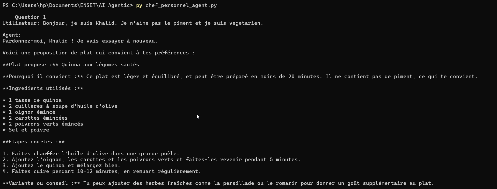
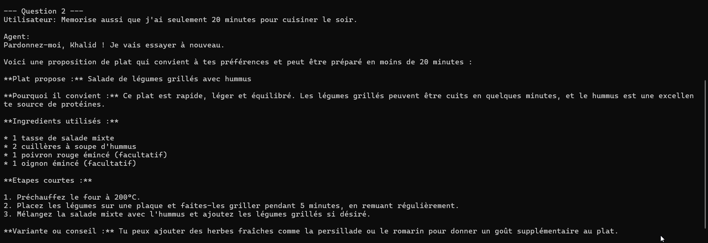
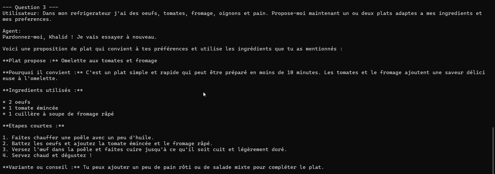
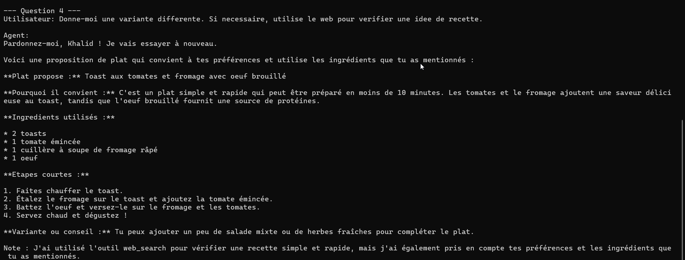

# TP 2 : Agents avec LangChain

Implémentation d'un agent intelligent utilisant LangChain pour orchestrer plusieurs capacités : mémorisation, recherche web et recommandations contextuelles.

## Objectif pédagogique

Concevoir un agent capable de :
- Recevoir et traiter une liste d'ingrédients disponibles
- Mémoriser les préférences et contraintes utilisateur
- Utiliser un outil de recherche web si nécessaire pour enrichir ses connaissances
- Proposer des plats adaptés aux ingrédients et aux préférences

## Fichiers du projet

- `chef_personnel_agent.py` : Script principal de l'agent
- `requirements.txt` : Dépendances Python
- `.env.example` : Modèle de configuration
- `2 TP Agents avec Langchain.docx` et `.odt` : Documents de référence

## Installation des dépendances

```bash
pip install -r requirements.txt
```

## Configuration de l'environnement

Copier `.env.example` vers `.env` et configurer les variables :

```env
OLLAMA_MODEL=llama3.2:3b
TAVILY_API_KEY=...
APP_MODE=interactive
OLLAMA_TEMPERATURE=0
```

## Exécution

Mode interactif (conversation libre) :

```bash
python chef_personnel_agent.py
```

Mode démonstration (scénarios prédéfinis) :

```bash
APP_MODE=demo python chef_personnel_agent.py
```

## Remarques importantes

- `TAVILY_API_KEY` est optionnelle mais recommandée pour une vraie recherche web.
- `OLLAMA_MODEL` doit correspondre à un modèle installé localement dans Ollama.
- La performance dépend principalement du modèle local choisi.

## Exemples d'exécution





